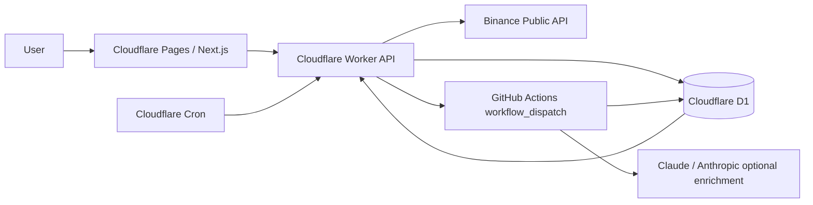

<p align="center">
  
</p>

# ByteSiren

**AI-assisted crypto market monitoring for public market signals.**

ByteSiren monitors major Binance spot pairs, detects market-wide or symbol-level movement windows, groups them into UTC day posts, and can enrich Signal Event and Daily Overview context with bounded Claude-backed source summaries.


**Live Demo:** https://bytesiren.pages.dev  
**API Health:** https://bytesiren-api.nephilim.workers.dev/api/health

## What Is ByteSiren?

ByteSiren is a public crypto market intelligence dashboard built as a portfolio/demo project. It watches major Binance spot pairs such as BTCUSDT, ETHUSDT, BNBUSDT, SOLUSDT, and XRPUSDT, then presents deterministic market movement analysis in a public v0.2 day-post feed.

The v0.2 feed is organized around:

- **Daily Overview** - a UTC-day market summary with deterministic metrics first and optional Claude context.
- **Market Story** - deterministic multi-window chart context that stays source-free and Claude-free.
- **Signal Event** - a compact evidence-window anomaly with per-symbol evidence and optional Claude context.

Chart and feed selection are linked, and source markers appear only when accepted Claude-backed sources exist for Signal or Daily cards. Audit Events are internal/debug-only and are not public feed items.

> Built to show deterministic market-data engineering, bounded AI enrichment, and production-safe demo deployment on Cloudflare.

ByteSiren is not a trading system, prediction engine, or investment advice product.

## Why It Matters

| Layer          | What It Uses                        | What It Shows                                |
| -------------- | ----------------------------------- | -------------------------------------------- |
| Market data    | 15-minute Binance candles           | Recent movement across tracked spot pairs    |
| Signals        | Deterministic detector windows      | Compact evidence for unusual movement        |
| Market Stories | Deterministic multi-window grouping | Broader chart context without cause claims   |
| Context        | Optional Claude-backed enrichment   | Source-aware summaries for Signal/Daily only |

## Highlights

**Core Product**

- v0.2 UTC day-post feed.
- Chart-linked Daily, Market Story, and Signal Event selection.
- Daily Overview cards with day-level market movement fields.
- Market Story cards for deterministic multi-window context.
- Signal Event evidence tables with per-symbol metrics.
- Responsive public demo hosted on Cloudflare Pages.

**Engineering**

- Cloudflare Worker API backed by Cloudflare D1.
- GitHub Actions for heavier offline snapshot refresh/import work.
- Cloudflare Cron for lightweight scheduling and workflow dispatch.
- Bounded incremental v0.2 Signal/Audit and open Market Story refresh.
- Deterministic refresh separated from Claude enrichment.
- Feature flags for v01/v02 feed rollback and operational control.
- Public API and hosted browser smoke tooling.

## Demo Flow

| Step | Action                     | What To Notice                                                      |
| ---- | -------------------------- | ------------------------------------------------------------------- |
| 1    | Open the dashboard         | Current market chart and v0.2 day-post feed                         |
| 2    | Review Daily Overview      | 24h Change, tone, top mover, and range context                      |
| 3    | Inspect Market Story       | Deterministic multi-window context with no Claude/source labels     |
| 4    | Open Signal Event          | Avg Change, Window Change, Peak 15m, and per-symbol evidence        |
| 5    | Click a chart or feed item | Linked chart/feed highlight behavior                                |
| 6    | Check context state        | Source-backed brief when enriched, or a plain missing-context state |

## Screenshots

Screenshots will be added after final public capture.

## Architecture



The Worker serves the public API, handles lightweight scheduled work, and dispatches GitHub workflows when needed. Binance candle data is stored in D1. GitHub Actions performs heavier deterministic snapshot refresh/import outside the Worker runtime. Incremental Signal and Market Story refresh stays bounded inside the Worker. Claude enrichment is separate: when enabled, it writes only to v0.2 Claude/source tables for Signal Event and Daily Overview targets.

The public frontend reads safe API responses only. It does not receive raw Claude traces, token counts, search budgets, rejected-source internals, or private validation metadata.

## Intelligence Model

### Daily Overview

A Daily Overview summarizes one UTC day. Deterministic fields are available first, including 24h Change, market tone, top daily mover, and widest range. Claude context can be added later, but the deterministic card should remain readable without it.

### Market Story

A Market Story is deterministic multi-window chart context. It can refresh while open/current and can be created when related Signals appear. It does not use Claude, does not have source chips, and does not present a cause label. It is descriptive market intelligence, not a trading setup.

### Signal Event

A Signal Event is a compact anomaly window. It uses metrics such as Avg Change, Window Change, Peak 15m, Volume x, and Range Position. Claude context is optional and sources appear only when accepted source rows exist.

### Audit Event

Audit Events are internal/debug evidence. They are not public feed cards.

## Refresh Model

Current production serves the public v0.2 feed with `FEED_VERSION=v02`.

- Market candle ingest runs on a Cloudflare-controlled cadence through GitHub Actions and Binance public data.
- Bounded v0.2 incremental Signal/Audit refresh runs on recent data windows.
- Current/open Market Story refresh runs incrementally.
- Full 31-day v0.2 snapshot rebuild/import is manual/backstop work through GitHub workflow dispatch.
- Worker-side historical v0.2 rebuild is avoided because the production Worker hit runtime/resource limits on historical detector windows.
- Claude enrichment is separate, bounded, and not required for the deterministic feed.

## AI / Claude Context Boundary

Claude is intended only for:

- `signal_event_v02`
- `daily_overview_v02`

Claude is not used for:

- Market Story cards
- Audit Events
- frontend-only generated copy
- trading advice or predictions

Accepted sources are displayed only for Claude-backed Signal/Daily cards. When context has not been generated or accepted, the UI can show a minimal missing-context state. Public responses must not expose raw Claude/tool traces, token counts, budget counts, search counts, rejected-source internals, or internal validation metadata.

## Engineering Highlights

| Highlight                   | Why It Matters                                                   |
| --------------------------- | ---------------------------------------------------------------- |
| Cloudflare-first deployment | Keeps the public demo inexpensive and edge-friendly              |
| D1 v0.2 schema separation   | Lets v0.1 fallback and v0.2 feed data coexist safely             |
| Incremental refresh         | Keeps recent Signal/Story rows fresher without full rebuilds     |
| Offline snapshot refresh    | Avoids Worker limits for heavy historical rebuilds               |
| Claude boundary             | Prevents Market Story/source leakage and keeps AI optional       |
| Feature flags               | Supports rollback between v01/v02 and controlled operations      |
| Smoke tooling               | Protects API shape, hosted rendering, and public data boundaries |
| Source policy               | Keeps public sources bounded, accepted, and exact                |

## Demo Limits / Safety

| Area            | Current Limit                                                     |
| --------------- | ----------------------------------------------------------------- |
| Market pairs    | Major Binance spot pairs                                          |
| Candle interval | 15m                                                               |
| Public context  | Deterministic first; Claude context is optional and bounded       |
| Sources         | Shown only for accepted Claude-backed Signal/Daily items          |
| Audit Events    | Internal only                                                     |
| Refresh         | Incremental production path plus manual/backstop snapshot refresh |

ByteSiren uses public market data and may lag, miss context, or show temporary unavailable states. Signals are not predictions. Market Stories are deterministic context, not trading recommendations. The public demo is intentionally bounded to protect resources and keep operational behavior observable.

## Project Structure

```text
ByteSiren/
  apps/web/              Next.js static web app
  apps/worker/           Cloudflare Worker API, D1 repositories, jobs
  scripts/               Local/offline refresh, import, Claude, and smoke tooling
  docs/scopian/sources/  Canonical project specs and deployment checklists
  .github/workflows/     GitHub Actions ingest, snapshot refresh, and Claude workflows
```

## Local Development

Install and verify from the repo root:

```bash
corepack enable
corepack pnpm install
corepack pnpm typecheck
corepack pnpm test
corepack pnpm lint
corepack pnpm build
corepack pnpm format:check
```

Useful local commands:

```bash
corepack pnpm worker:dev
corepack pnpm web:build
corepack pnpm web:export:check
corepack pnpm --filter @bytesiren/web dev
corepack pnpm --filter @bytesiren/web smoke:v02-real-api
corepack pnpm --filter @bytesiren/worker deploy:dry
```

Use `apps/worker/.dev.vars.example` and `apps/web/.env.local.example` as templates if present. Do not commit real `.dev.vars`, `.env.local`, tokens, or API keys.

## Environment Checklist

**Worker / Cloudflare**

- `DB` D1 binding
- `MARKET_IMPORT_TOKEN`
- `GITHUB_INGEST_DISPATCH_TOKEN`
- `FEED_VERSION`
- `ENABLE_SCHEDULED_JOBS`
- `ENABLE_V02_INCREMENTAL_REFRESH`
- `ENABLE_V02_INCREMENTAL_SIGNALS`
- `ENABLE_V02_INCREMENTAL_MARKET_STORIES`
- Claude/admin flags, disabled unless a bounded owner-approved operation needs them

**Web / Pages**

- `NEXT_PUBLIC_API_BASE_URL`

**GitHub Actions**

- `CLOUDFLARE_API_TOKEN`
- `CLOUDFLARE_ACCOUNT_ID` when required by the runner environment
- `ANTHROPIC_API_KEY` only for bounded Claude enrichment workflows

## Deployment

- **Frontend:** Cloudflare Pages static export from `apps/web`.
- **API:** Cloudflare Worker from `apps/worker`.
- **Database:** Cloudflare D1.
- **Market data automation:** Cloudflare Cron dispatches GitHub Actions ingest work.
- **v0.2 refresh:** bounded Worker incremental refresh plus manual/backstop GitHub snapshot refresh.
- **Public feed switch:** `FEED_VERSION=v02`.
- **Rollback:** set `FEED_VERSION=v01`.
- **Claude:** controlled separately through workflow and feature flags.

## Safety And Boundaries

- No real secrets belong in the repository.
- `.dev.vars` and `.env.local` are local-only.
- Public API responses hide raw Claude traces, tool traces, token counts, budget counts, and internal validation metadata.
- Market Story is deterministic and source-free.
- Audit Events are internal/debug-only.
- No trading or investment advice is provided.
- Missing Claude context is an expected state while enrichment is disabled, bounded, pending, or partially backfilled.

## Status

- Public v0.2 feed is live.
- Tracked Worker config defaults to `FEED_VERSION=v02`.
- Deterministic incremental v0.2 refresh is enabled.
- Manual/backstop v0.2 snapshot refresh is available through GitHub workflow dispatch.
- Claude enrichment is optional, bounded, and separate from the deterministic public feed.
- Source context depends on the current Claude enrichment/backfill state.
- This is a portfolio demo, not a production trading tool.

## License

No license file is present.
